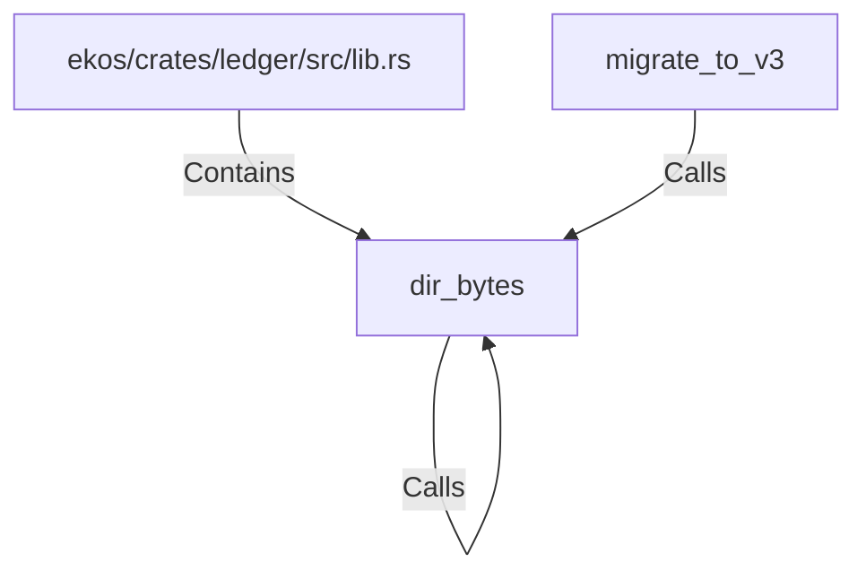

# dir_bytes (RustSymbol)

## Properties

| Key | Value |
|---|---|
| `kind` | function |

## Relationships

### Calls

- ← migrate_to_v3 (`1dab3f65-615b-56e9-ae9b-e92c32a2cb63`)
- → dir_bytes (`94d64c98-e745-574a-89b3-8734f99623eb`)

### Contains

- ← ekos/crates/ledger/src/lib.rs (`21938f45-b767-5933-9e71-12e15ff53eb1`)

## Diagram

## Evidence

_No evidence cited._
