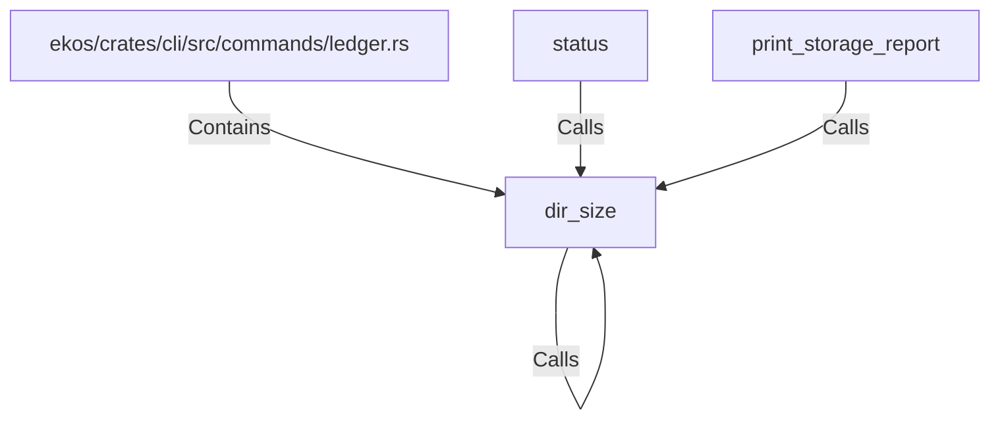

# dir_size (RustSymbol)

## Properties

| Key | Value |
|---|---|
| `kind` | function |

## Relationships

### Calls

- ← status (`f4b534fa-f104-5a49-993e-7b08b0b618c6`)
- ← print_storage_report (`d032d51f-6a39-5f79-8089-541c63e5c472`)
- → dir_size (`e58c8e45-8b1f-5641-90e0-3c1ee0c783db`)

### Contains

- ← ekos/crates/cli/src/commands/ledger.rs (`00bf5c8a-7198-5df3-a6eb-5bf22bc8ddcb`)

## Diagram

## Evidence

_No evidence cited._
