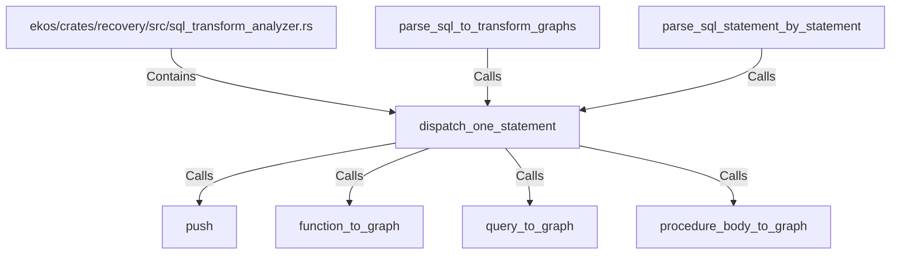

# dispatch_one_statement (RustSymbol)

## Properties

| Key | Value |
|---|---|
| `kind` | function |

## Relationships

### Calls

- ← parse_sql_to_transform_graphs (`fbbf8304-b139-51e0-bbeb-a3ae80044130`)
- → push (`cc223cbc-9afd-5086-9f88-8c6d484895d1`)
- → function_to_graph (`fb4a63c1-3690-5bee-b424-6e26e9a46525`)
- → query_to_graph (`f816648e-a2ad-50bd-bd73-494fdbbbad49`)
- → procedure_body_to_graph (`7ec44c96-a38e-5bf5-8c0f-3683d9b61662`)
- ← parse_sql_statement_by_statement (`5496bf59-6cfe-5208-8e5c-2ac011f7f9d8`)

### Contains

- ← ekos/crates/recovery/src/sql_transform_analyzer.rs (`987e3fbb-31ec-576d-b794-7e801336e8c8`)

## Diagram

## Evidence

_No evidence cited._
