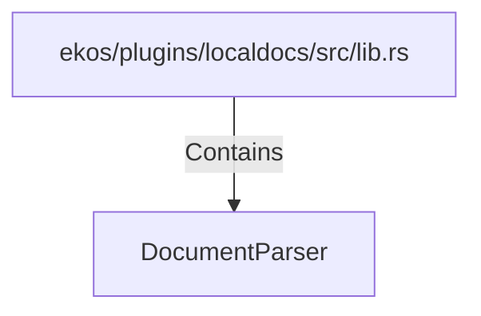

# DocumentParser (RustSymbol)

## Properties

| Key | Value |
|---|---|
| `kind` | trait |

## Relationships

### Contains

- ← ekos/plugins/localdocs/src/lib.rs (`1ed81bd1-9be1-5cda-9158-9ad4f1980e3d`)

## Diagram

## Evidence

_No evidence cited._
