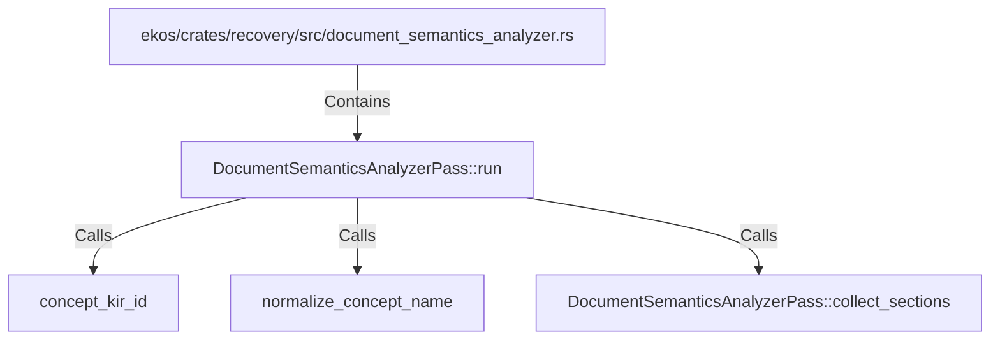

# DocumentSemanticsAnalyzerPass::run (RustSymbol)

## Properties

| Key | Value |
|---|---|
| `kind` | method |

## Relationships

### Calls

- → concept_kir_id (`ab81e306-d655-5dce-b154-06330611490b`)
- → normalize_concept_name (`15a9b648-bf80-53fb-b983-b06f32cf57ca`)
- → DocumentSemanticsAnalyzerPass::collect_sections (`c02745f9-9504-5e9e-8788-41ab8d507547`)

### Contains

- ← ekos/crates/recovery/src/document_semantics_analyzer.rs (`62e92526-f096-5ed2-bc72-0bdae8703aa3`)

## Diagram

## Evidence

_No evidence cited._
