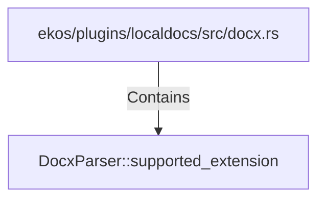

# DocxParser::supported_extension (RustSymbol)

## Properties

| Key | Value |
|---|---|
| `kind` | method |

## Relationships

### Contains

- ← ekos/plugins/localdocs/src/docx.rs (`cb8db45b-ec2c-50f2-8053-0fd63dba3355`)

## Diagram

## Evidence

_No evidence cited._
