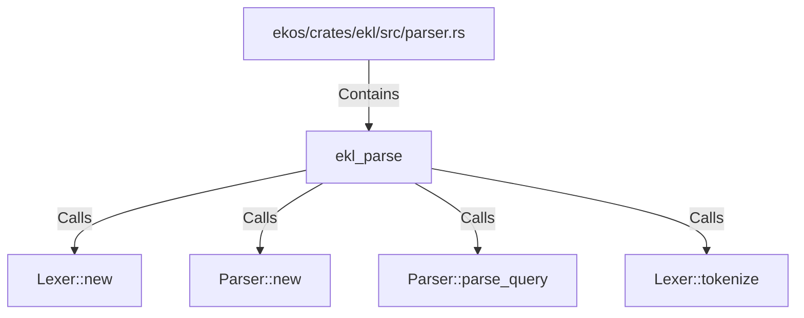

# ekl_parse (RustSymbol)

## Properties

| Key | Value |
|---|---|
| `kind` | function |

## Relationships

### Calls

- → Lexer::new (`719d674a-ff2f-560b-8cce-a9458c019026`)
- → Parser::new (`7d33f28a-3f46-59ed-b13d-496c9f39216d`)
- → Parser::parse_query (`4147b7b9-9d99-5be9-b91f-42752c6f6561`)
- → Lexer::tokenize (`75766aca-22b9-59f6-aa0b-7e6588ae0af9`)

### Contains

- ← ekos/crates/ekl/src/parser.rs (`7eda2531-87c8-5048-92b2-c98483606431`)

## Diagram

## Evidence

_No evidence cited._
