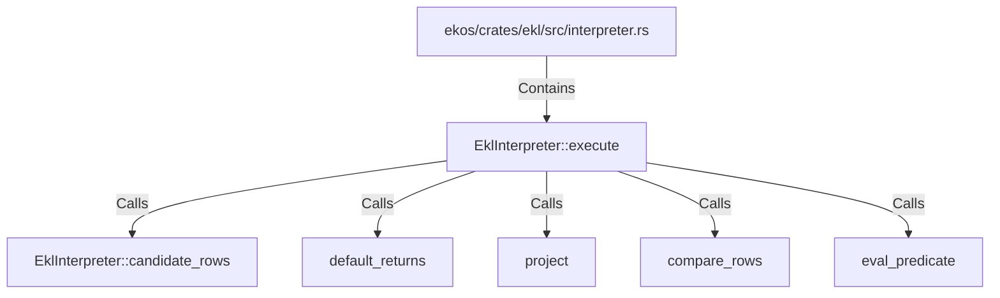

# EklInterpreter::execute (RustSymbol)

## Properties

| Key | Value |
|---|---|
| `kind` | method |

## Relationships

### Calls

- → EklInterpreter::candidate_rows (`9f9ddd90-3313-5772-9e6b-1a6c3050ad11`)
- → default_returns (`e8072521-557d-545e-b833-f3d849872856`)
- → project (`990853c7-8608-562b-aea0-df03bfbfaa73`)
- → compare_rows (`91663026-81cb-5c5e-912c-7ffe203d4ed6`)
- → eval_predicate (`db424b5e-3b63-590d-8e63-197b48efa89a`)

### Contains

- ← ekos/crates/ekl/src/interpreter.rs (`9c2cb6e4-ee09-503f-8cf5-ccfaf23ecd79`)

## Diagram

## Evidence

_No evidence cited._
