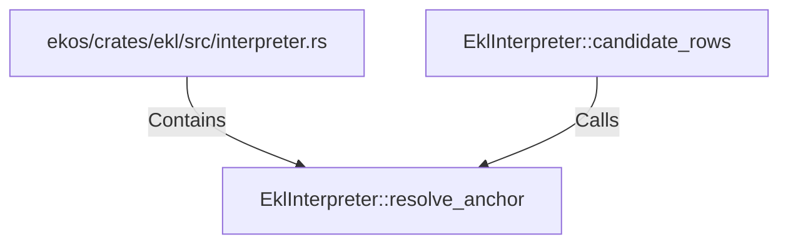

# EklInterpreter::resolve_anchor (RustSymbol)

## Properties

| Key | Value |
|---|---|
| `kind` | method |

## Relationships

### Calls

- ← EklInterpreter::candidate_rows (`9f9ddd90-3313-5772-9e6b-1a6c3050ad11`)

### Contains

- ← ekos/crates/ekl/src/interpreter.rs (`9c2cb6e4-ee09-503f-8cf5-ccfaf23ecd79`)

## Diagram

## Evidence

_No evidence cited._
