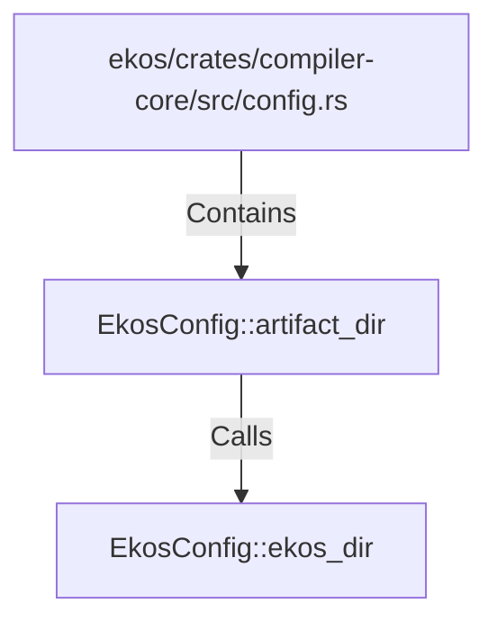

# EkosConfig::artifact_dir (RustSymbol)

## Properties

| Key | Value |
|---|---|
| `kind` | method |

## Relationships

### Calls

- → EkosConfig::ekos_dir (`2ae501da-572c-53d9-84c5-837ab91b23f9`)

### Contains

- ← ekos/crates/compiler-core/src/config.rs (`d0747f34-25e1-5426-80eb-a54fffcac598`)

## Diagram

## Evidence

_No evidence cited._
