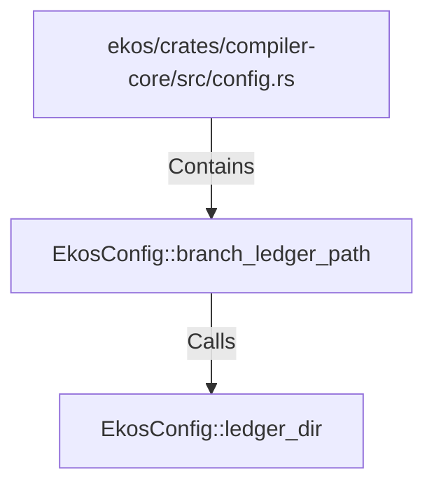

# EkosConfig::branch_ledger_path (RustSymbol)

## Properties

| Key | Value |
|---|---|
| `kind` | method |

## Relationships

### Calls

- → EkosConfig::ledger_dir (`3356e338-00e2-5af6-ae58-8eab5122377b`)

### Contains

- ← ekos/crates/compiler-core/src/config.rs (`d0747f34-25e1-5426-80eb-a54fffcac598`)

## Diagram

## Evidence

_No evidence cited._
