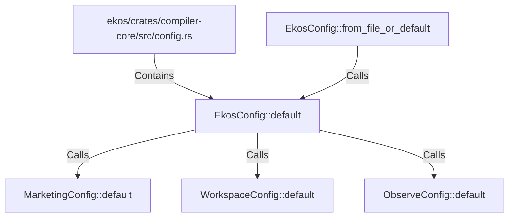

# EkosConfig::default (RustSymbol)

## Properties

| Key | Value |
|---|---|
| `kind` | method |

## Relationships

### Calls

- → MarketingConfig::default (`3fa1fe51-5c40-500e-a4af-e9b3dfeb907f`)
- → WorkspaceConfig::default (`86487b2d-47d6-5105-807b-404b12767a95`)
- → ObserveConfig::default (`db53c97e-788e-587b-a5d4-fbff7497f34e`)
- ← EkosConfig::from_file_or_default (`5c036ac3-203e-5c59-88f2-d79a35ccf921`)

### Contains

- ← ekos/crates/compiler-core/src/config.rs (`d0747f34-25e1-5426-80eb-a54fffcac598`)

## Diagram

## Evidence

_No evidence cited._
