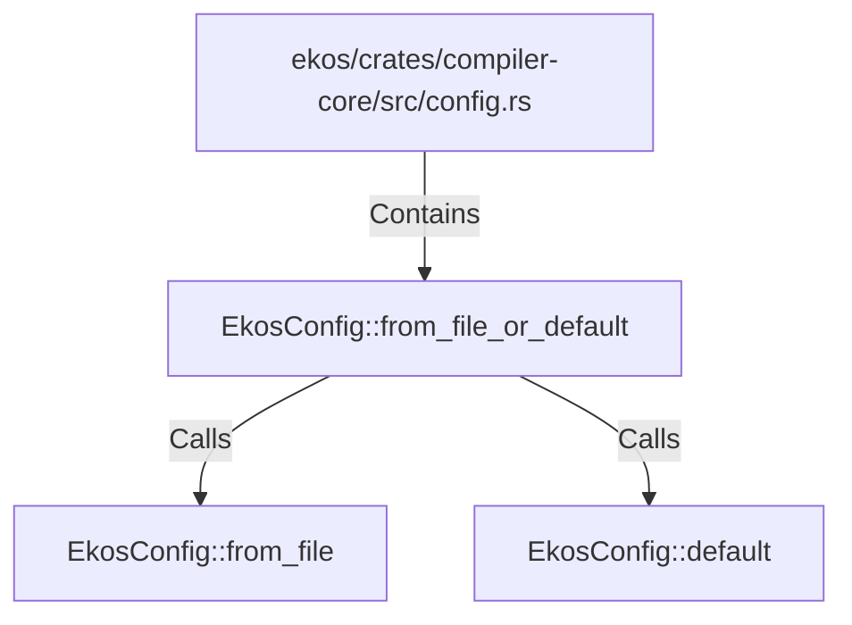

# EkosConfig::from_file_or_default (RustSymbol)

## Properties

| Key | Value |
|---|---|
| `kind` | method |

## Relationships

### Calls

- → EkosConfig::from_file (`6c6a765c-3f26-501e-8d3a-8393454e9273`)
- → EkosConfig::default (`96f3be94-9761-5db0-b99a-0c705c9c55d0`)

### Contains

- ← ekos/crates/compiler-core/src/config.rs (`d0747f34-25e1-5426-80eb-a54fffcac598`)

## Diagram

## Evidence

_No evidence cited._
