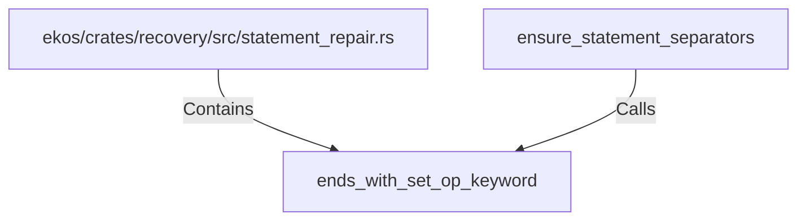

# ends_with_set_op_keyword (RustSymbol)

## Properties

| Key | Value |
|---|---|
| `kind` | function |

## Relationships

### Calls

- ← ensure_statement_separators (`1b2dc403-f43f-5719-912d-cb9f12d3cadb`)

### Contains

- ← ekos/crates/recovery/src/statement_repair.rs (`3ce1a143-e6f7-5a08-a3ba-cef397eb9447`)

## Diagram

## Evidence

_No evidence cited._
