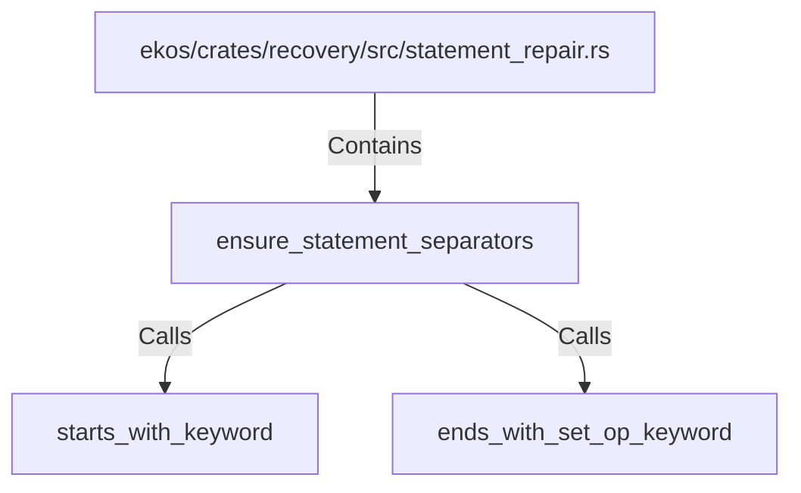

# ensure_statement_separators (RustSymbol)

## Properties

| Key | Value |
|---|---|
| `kind` | function |

## Relationships

### Calls

- → starts_with_keyword (`b60eebb1-ab9e-50e7-a550-162f7c6481ec`)
- → ends_with_set_op_keyword (`167e3cae-ee0f-52f4-bf81-52199410ffe7`)

### Contains

- ← ekos/crates/recovery/src/statement_repair.rs (`3ce1a143-e6f7-5a08-a3ba-cef397eb9447`)

## Diagram

## Evidence

_No evidence cited._
