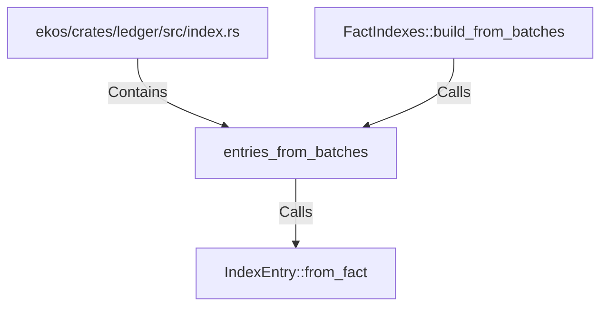

# entries_from_batches (RustSymbol)

## Properties

| Key | Value |
|---|---|
| `kind` | function |

## Relationships

### Calls

- → IndexEntry::from_fact (`2fd9d8a2-1c89-5478-8e80-95a3253931e9`)
- ← FactIndexes::build_from_batches (`01b36534-35a3-5736-8a1e-c727d7f48136`)

### Contains

- ← ekos/crates/ledger/src/index.rs (`a43fa387-2cac-5166-bfc2-ae4c965fc2ac`)

## Diagram

## Evidence

_No evidence cited._
