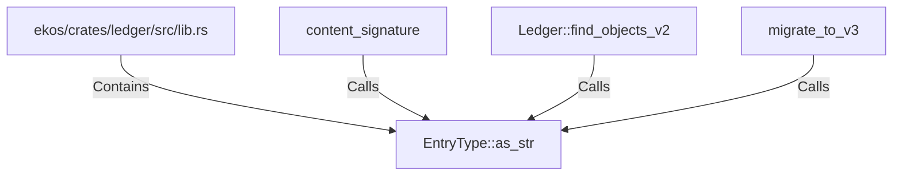

# EntryType::as_str (RustSymbol)

## Properties

| Key | Value |
|---|---|
| `kind` | method |

## Relationships

### Calls

- ← content_signature (`66c7da48-70e5-57fb-9882-5a5b05933963`)
- ← Ledger::find_objects_v2 (`c1f796f9-4eda-5e58-bfc1-90620e984000`)
- ← migrate_to_v3 (`1dab3f65-615b-56e9-ae9b-e92c32a2cb63`)

### Contains

- ← ekos/crates/ledger/src/lib.rs (`21938f45-b767-5933-9e71-12e15ff53eb1`)

## Diagram

## Evidence

_No evidence cited._
