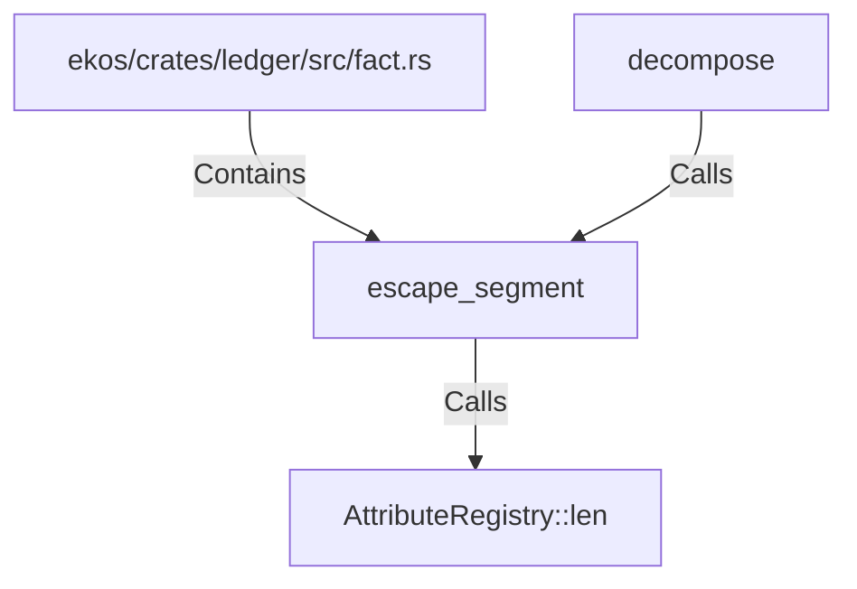

# escape_segment (RustSymbol)

## Properties

| Key | Value |
|---|---|
| `kind` | function |

## Relationships

### Calls

- → AttributeRegistry::len (`c441faa0-58d8-5de0-9575-74cc0e087136`)
- ← decompose (`a37fe3f9-4d7a-596d-b18f-e9d9d4931c36`)

### Contains

- ← ekos/crates/ledger/src/fact.rs (`7837f9fa-7178-5151-a068-e75361336c37`)

## Diagram

## Evidence

_No evidence cited._
