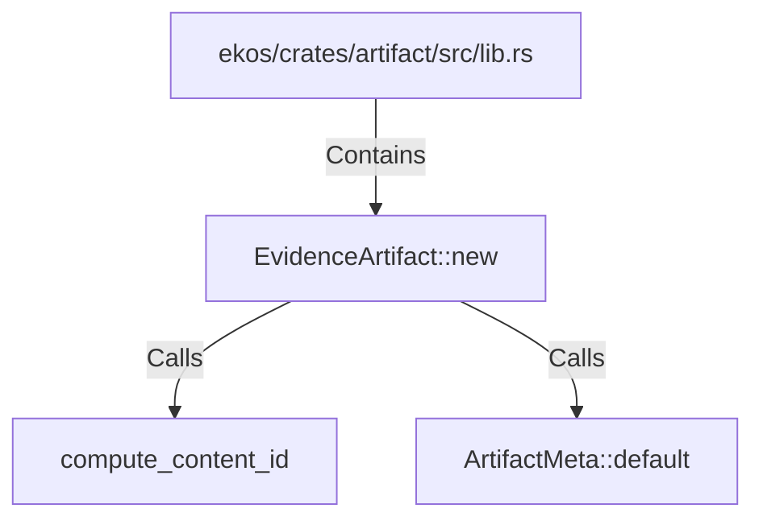

# EvidenceArtifact::new (RustSymbol)

## Properties

| Key | Value |
|---|---|
| `kind` | method |

## Relationships

### Calls

- → compute_content_id (`68328ad4-597d-5947-afb0-8d5a0804e3dd`)
- → ArtifactMeta::default (`75608e6d-ce35-5321-97af-f8b9d4f486b2`)

### Contains

- ← ekos/crates/artifact/src/lib.rs (`918532b1-7390-5128-8de5-faf4f7a91daf`)

## Diagram

## Evidence

_No evidence cited._
