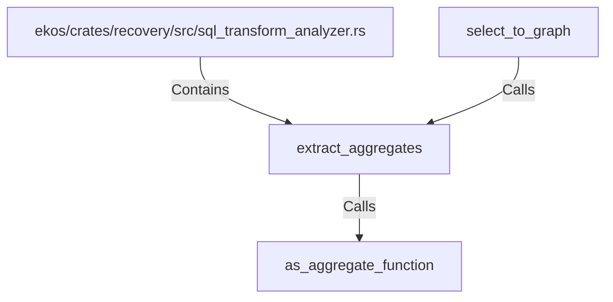

# extract_aggregates (RustSymbol)

## Properties

| Key | Value |
|---|---|
| `kind` | function |

## Relationships

### Calls

- ← select_to_graph (`cb80b4b3-9be9-5aae-828e-f0d4f3ec4336`)
- → as_aggregate_function (`a2dbec2a-9c4a-517a-9cc0-1107daa41b02`)

### Contains

- ← ekos/crates/recovery/src/sql_transform_analyzer.rs (`987e3fbb-31ec-576d-b794-7e801336e8c8`)

## Diagram

## Evidence

_No evidence cited._
