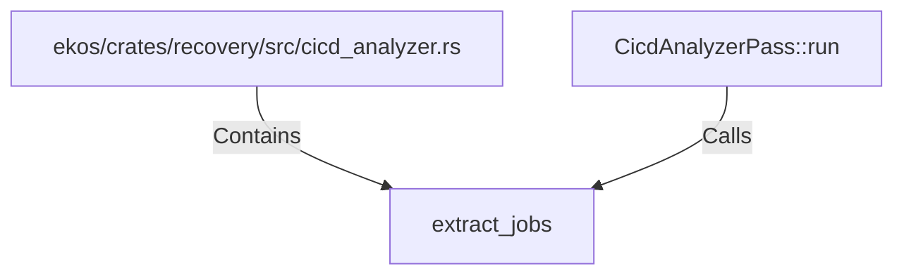

# extract_jobs (RustSymbol)

## Properties

| Key | Value |
|---|---|
| `kind` | function |

## Relationships

### Calls

- ← CicdAnalyzerPass::run (`1f592577-a349-504e-bf9b-846299c8c7c8`)

### Contains

- ← ekos/crates/recovery/src/cicd_analyzer.rs (`b6532a21-993c-5d28-8d99-891c30d70063`)

## Diagram

## Evidence

_No evidence cited._
