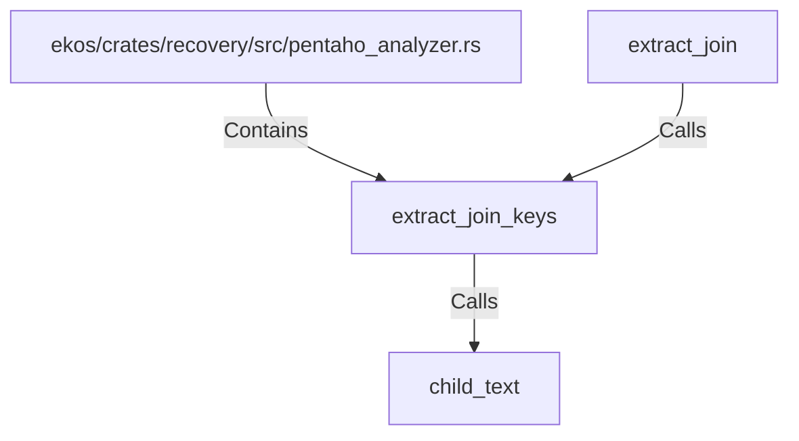

# extract_join_keys (RustSymbol)

## Properties

| Key | Value |
|---|---|
| `kind` | function |

## Relationships

### Calls

- ← extract_join (`450b2ac3-e3bb-5b8b-a2d1-ed9e281bc3b2`)
- → child_text (`f70791ea-bde4-57ab-8af1-ccc69fa9f5a7`)

### Contains

- ← ekos/crates/recovery/src/pentaho_analyzer.rs (`ce3d2f1b-e1c6-55d7-92bc-c1b69f76dbca`)

## Diagram

## Evidence

_No evidence cited._
