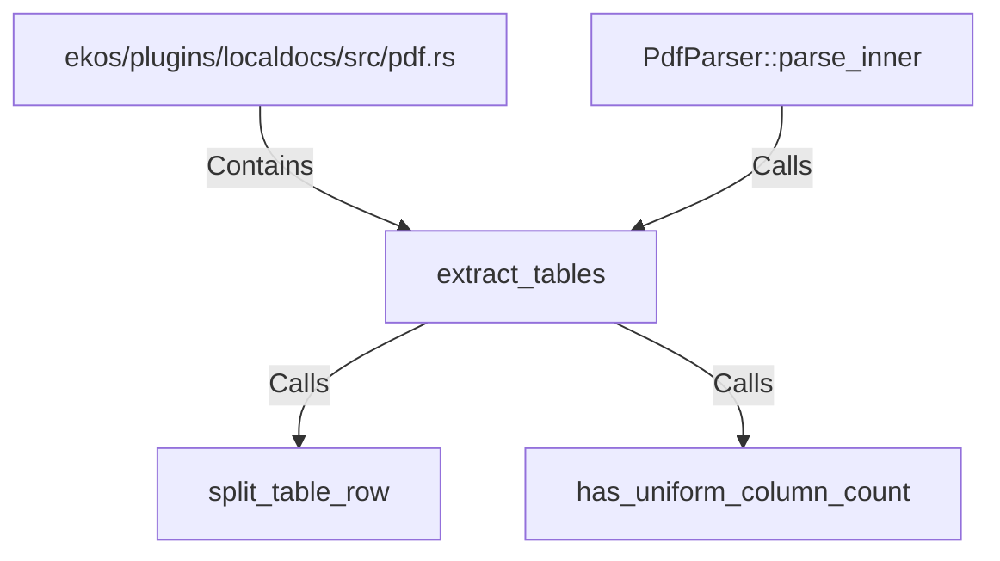

# extract_tables (RustSymbol)

## Properties

| Key | Value |
|---|---|
| `kind` | function |

## Relationships

### Calls

- ← PdfParser::parse_inner (`890fac4f-26ec-5bd0-af92-a13e19654f8e`)
- → split_table_row (`4868b5eb-e464-546c-b3d6-13dcd647b357`)
- → has_uniform_column_count (`4fc2a426-f74b-5e8e-b20d-e13e5d5492fc`)

### Contains

- ← ekos/plugins/localdocs/src/pdf.rs (`c8cae073-dd9b-50d2-8942-335d3cdf47b3`)

## Diagram

## Evidence

_No evidence cited._
