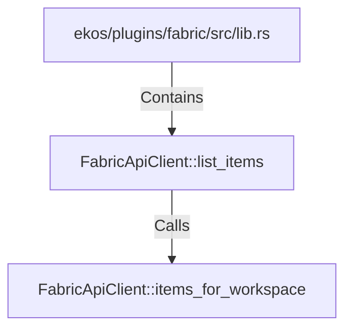

# FabricApiClient::list_items (RustSymbol)

## Properties

| Key | Value |
|---|---|
| `kind` | method |

## Relationships

### Calls

- → FabricApiClient::items_for_workspace (`eed08c14-bd86-5b62-b147-4288ff2b2685`)

### Contains

- ← ekos/plugins/fabric/src/lib.rs (`ea3988ed-2565-56db-b0cf-09b6d4594525`)

## Diagram

## Evidence

_No evidence cited._
