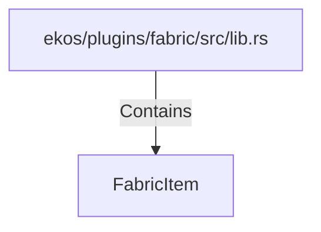

# FabricItem (RustSymbol)

## Properties

| Key | Value |
|---|---|
| `kind` | struct |

## Relationships

### Contains

- ← ekos/plugins/fabric/src/lib.rs (`ea3988ed-2565-56db-b0cf-09b6d4594525`)

## Diagram

## Evidence

_No evidence cited._
