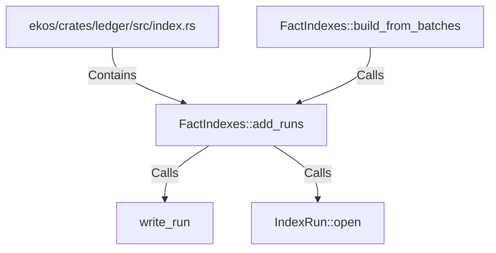

# FactIndexes::add_runs (RustSymbol)

## Properties

| Key | Value |
|---|---|
| `kind` | method |

## Relationships

### Calls

- → write_run (`944c015c-ad50-5e55-9238-7d57ee4ed67b`)
- → IndexRun::open (`f1391221-58bc-5970-9495-3366e24cd6f1`)
- ← FactIndexes::build_from_batches (`01b36534-35a3-5736-8a1e-c727d7f48136`)

### Contains

- ← ekos/crates/ledger/src/index.rs (`a43fa387-2cac-5166-bfc2-ae4c965fc2ac`)

## Diagram

## Evidence

_No evidence cited._
