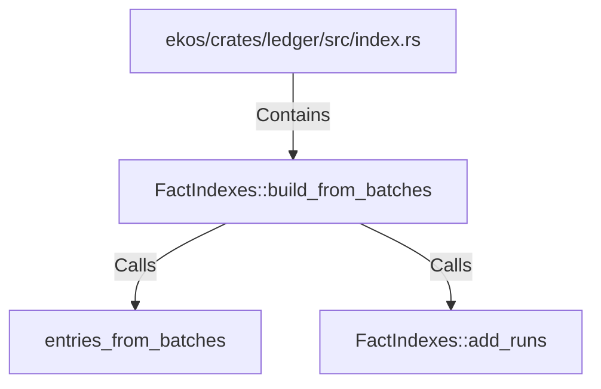

# FactIndexes::build_from_batches (RustSymbol)

## Properties

| Key | Value |
|---|---|
| `kind` | method |

## Relationships

### Calls

- → entries_from_batches (`1a7fc575-224c-562e-a9ba-bce6552c54e4`)
- → FactIndexes::add_runs (`4f62bd8f-a002-5bbb-8bc9-5c708f2849a5`)

### Contains

- ← ekos/crates/ledger/src/index.rs (`a43fa387-2cac-5166-bfc2-ae4c965fc2ac`)

## Diagram

## Evidence

_No evidence cited._
