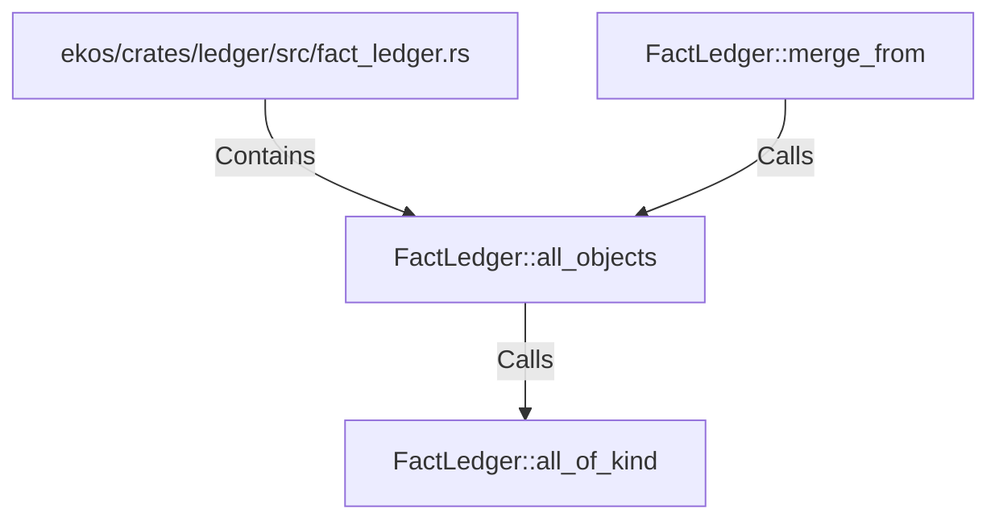

# FactLedger::all_objects (RustSymbol)

## Properties

| Key | Value |
|---|---|
| `kind` | method |

## Relationships

### Calls

- → FactLedger::all_of_kind (`96be8663-06e0-5092-9271-602b15b98872`)
- ← FactLedger::merge_from (`f49a099f-a554-5182-9200-3f842f56b4b7`)

### Contains

- ← ekos/crates/ledger/src/fact_ledger.rs (`eadcb59e-818f-5d1e-af87-ff29aba11423`)

## Diagram

## Evidence

_No evidence cited._
