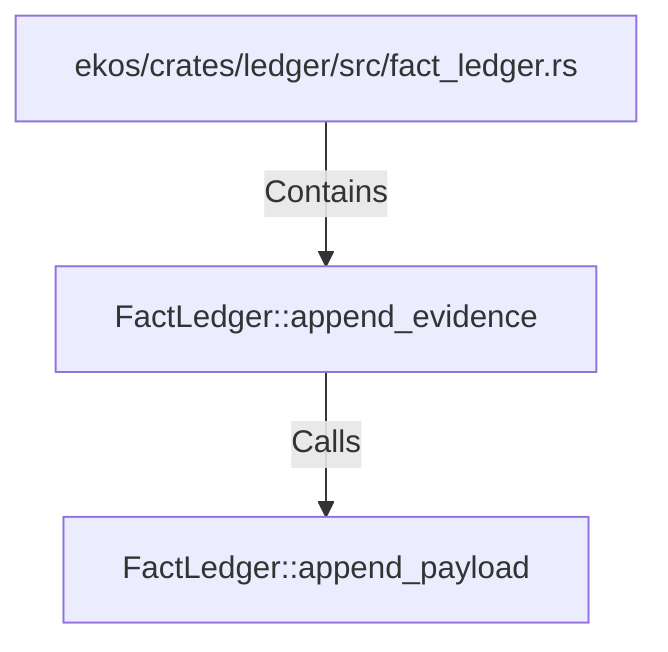

# FactLedger::append_evidence (RustSymbol)

## Properties

| Key | Value |
|---|---|
| `kind` | method |

## Relationships

### Calls

- → FactLedger::append_payload (`59ba0d10-1ac6-5b4b-96f4-c69cac0c6d89`)

### Contains

- ← ekos/crates/ledger/src/fact_ledger.rs (`eadcb59e-818f-5d1e-af87-ff29aba11423`)

## Diagram

## Evidence

_No evidence cited._
