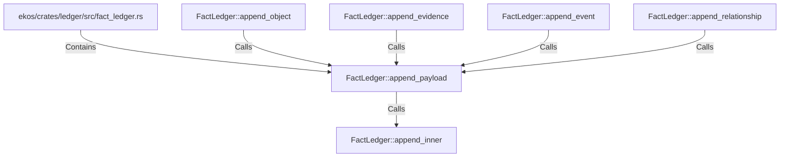

# FactLedger::append_payload (RustSymbol)

## Properties

| Key | Value |
|---|---|
| `kind` | method |

## Relationships

### Calls

- ← FactLedger::append_object (`80968d4b-8f2c-5ecc-9368-42863245986e`)
- ← FactLedger::append_evidence (`2e115223-2707-56f3-853a-b59319f23c31`)
- ← FactLedger::append_event (`ceeb005e-d8b7-5f22-84db-9ddcb1cad760`)
- ← FactLedger::append_relationship (`13eab4a6-a185-5803-a090-8def742c8045`)
- → FactLedger::append_inner (`abbc13e0-8705-5d3c-aa78-d21e9a9882ee`)

### Contains

- ← ekos/crates/ledger/src/fact_ledger.rs (`eadcb59e-818f-5d1e-af87-ff29aba11423`)

## Diagram

## Evidence

_No evidence cited._
