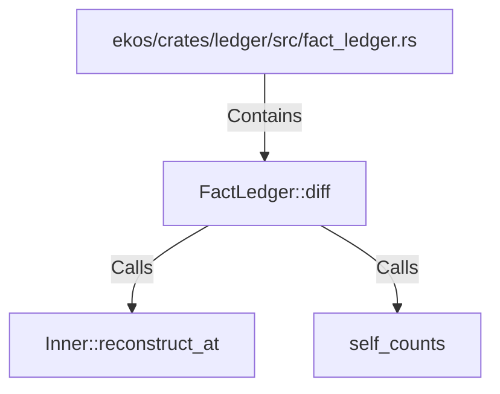

# FactLedger::diff (RustSymbol)

## Properties

| Key | Value |
|---|---|
| `kind` | method |

## Relationships

### Calls

- → Inner::reconstruct_at (`79bd7404-2990-533f-b4f5-b3d167543336`)
- → self_counts (`ce94f529-4432-555b-895b-41dffaad4ba6`)

### Contains

- ← ekos/crates/ledger/src/fact_ledger.rs (`eadcb59e-818f-5d1e-af87-ff29aba11423`)

## Diagram

## Evidence

_No evidence cited._
