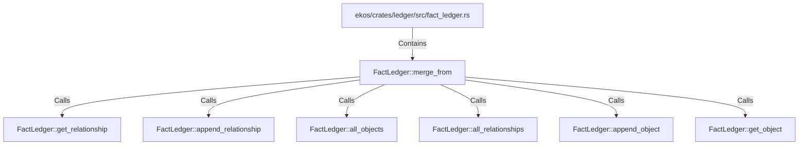

# FactLedger::merge_from (RustSymbol)

## Properties

| Key | Value |
|---|---|
| `kind` | method |

## Relationships

### Calls

- → FactLedger::get_relationship (`c6fb9c16-6ed5-5cea-98ef-75a6ed96b979`)
- → FactLedger::append_relationship (`13eab4a6-a185-5803-a090-8def742c8045`)
- → FactLedger::all_objects (`10d9bb5d-983b-571b-80a4-980eda139690`)
- → FactLedger::all_relationships (`09e04918-5498-5c94-8d69-c84e67fef17d`)
- → FactLedger::append_object (`80968d4b-8f2c-5ecc-9368-42863245986e`)
- → FactLedger::get_object (`7c9ba14e-5785-5789-88ed-e471ea3451de`)

### Contains

- ← ekos/crates/ledger/src/fact_ledger.rs (`eadcb59e-818f-5d1e-af87-ff29aba11423`)

## Diagram

## Evidence

_No evidence cited._
