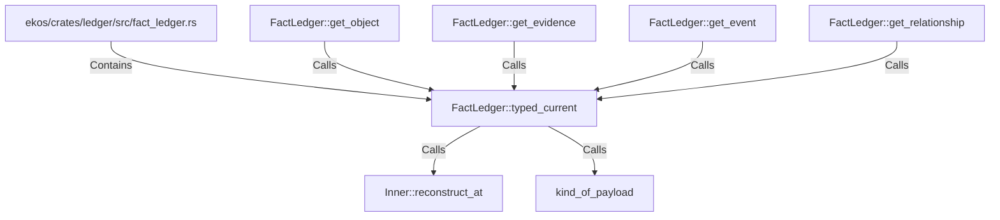

# FactLedger::typed_current (RustSymbol)

## Properties

| Key | Value |
|---|---|
| `kind` | method |

## Relationships

### Calls

- ← FactLedger::get_object (`7c9ba14e-5785-5789-88ed-e471ea3451de`)
- ← FactLedger::get_evidence (`448d1f84-aec7-5f32-9175-799189f617d4`)
- ← FactLedger::get_event (`afd17061-be0e-5b46-9e93-044793d5fac7`)
- ← FactLedger::get_relationship (`c6fb9c16-6ed5-5cea-98ef-75a6ed96b979`)
- → Inner::reconstruct_at (`79bd7404-2990-533f-b4f5-b3d167543336`)
- → kind_of_payload (`abd8ce5a-e663-50ce-a42f-e2c4a13c43fb`)

### Contains

- ← ekos/crates/ledger/src/fact_ledger.rs (`eadcb59e-818f-5d1e-af87-ff29aba11423`)

## Diagram

## Evidence

_No evidence cited._
