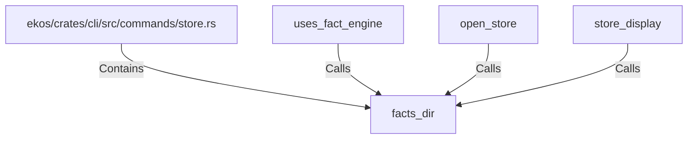

# facts_dir (RustSymbol)

## Properties

| Key | Value |
|---|---|
| `kind` | function |

## Relationships

### Calls

- ← uses_fact_engine (`10d67e5a-c754-5199-915e-23349038a6f5`)
- ← open_store (`ce911a52-3055-56e0-bea7-c15a5ff1d773`)
- ← store_display (`713ed7cc-5c75-533e-89bc-0a3cd1e3b880`)

### Contains

- ← ekos/crates/cli/src/commands/store.rs (`ce2ed217-2b42-5760-9d2e-e2ca1574a517`)

## Diagram

## Evidence

_No evidence cited._
