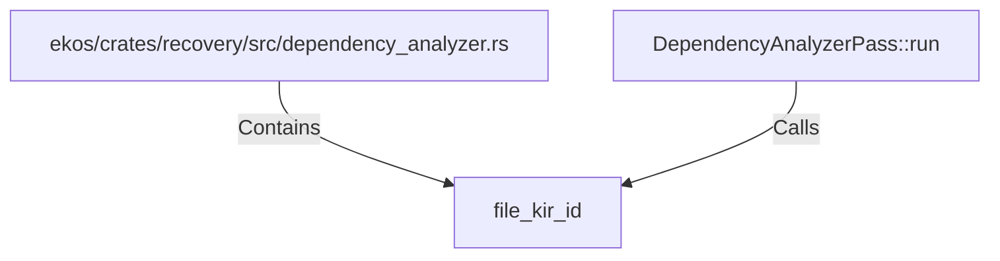

# file_kir_id (RustSymbol)

## Properties

| Key | Value |
|---|---|
| `kind` | function |

## Relationships

### Calls

- ← DependencyAnalyzerPass::run (`475a1d03-06fe-51b5-8d6a-900346c11ae6`)

### Contains

- ← ekos/crates/recovery/src/dependency_analyzer.rs (`9baa718a-d61d-554c-a791-7798003ba6c4`)

## Diagram

## Evidence

_No evidence cited._
