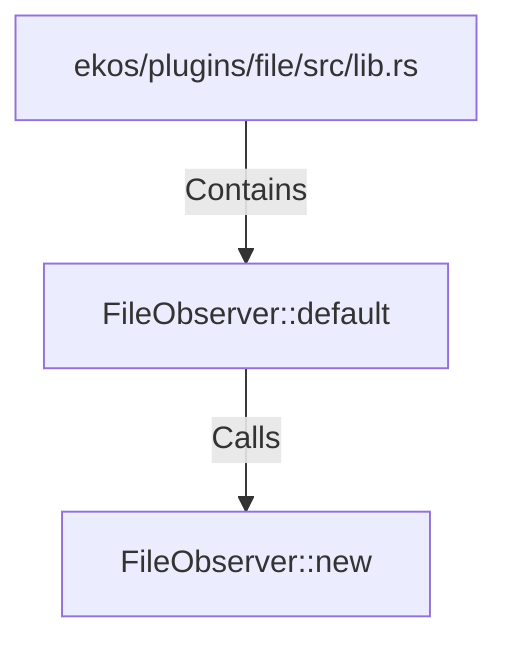

# FileObserver::default (RustSymbol)

## Properties

| Key | Value |
|---|---|
| `kind` | method |

## Relationships

### Calls

- → FileObserver::new (`f0afeda2-77a8-51ce-b306-ed63f7f104a2`)

### Contains

- ← ekos/plugins/file/src/lib.rs (`7cdc5253-6617-5e49-81c7-9e227a76c44b`)

## Diagram

## Evidence

_No evidence cited._
