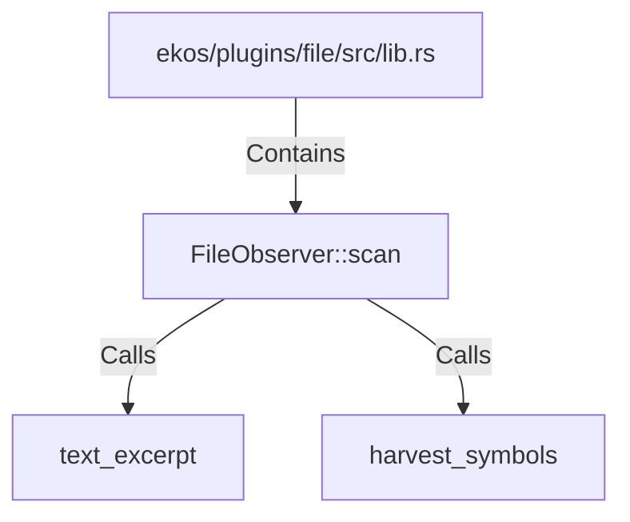

# FileObserver::scan (RustSymbol)

## Properties

| Key | Value |
|---|---|
| `kind` | method |

## Relationships

### Calls

- → text_excerpt (`0b8aa21e-3bd1-51e4-beaa-2f3264e7e319`)
- → harvest_symbols (`b126af85-d844-5170-a0b1-f39cd17e03d8`)

### Contains

- ← ekos/plugins/file/src/lib.rs (`7cdc5253-6617-5e49-81c7-9e227a76c44b`)

## Diagram

## Evidence

_No evidence cited._
