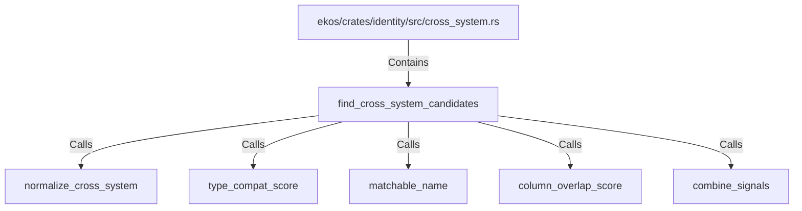

# find_cross_system_candidates (RustSymbol)

## Properties

| Key | Value |
|---|---|
| `kind` | function |

## Relationships

### Calls

- → normalize_cross_system (`70e3e344-be1f-53b0-b84d-ed93f29ff4e4`)
- → type_compat_score (`20571641-04cb-5dd0-846a-7cb921b2e2be`)
- → matchable_name (`890f9527-fef5-5556-bf1c-41613f51627e`)
- → column_overlap_score (`443f6bee-3576-5436-9013-bb79b5867fd2`)
- → combine_signals (`6522c3f2-5c8a-5d32-81c9-b0e4f61a4750`)

### Contains

- ← ekos/crates/identity/src/cross_system.rs (`44d130a8-ca02-506d-bc1a-21b037fb492c`)

## Diagram

## Evidence

_No evidence cited._
