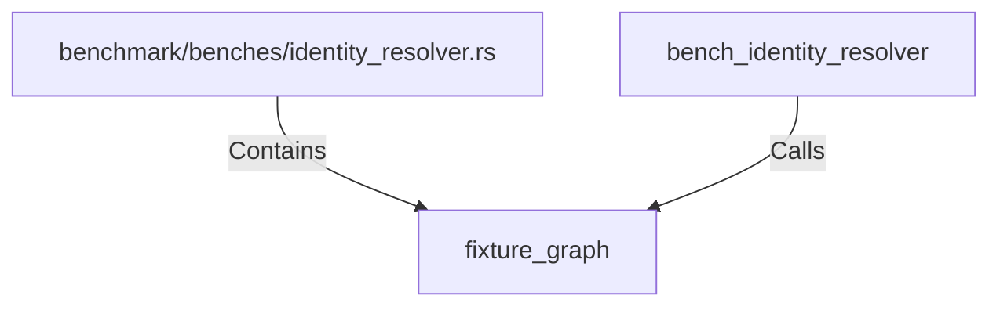

# fixture_graph (RustSymbol)

## Properties

| Key | Value |
|---|---|
| `kind` | function |

## Relationships

### Calls

- ← bench_identity_resolver (`5a5e83fa-2f48-5d29-a17d-7650f8d1b151`)

### Contains

- ← benchmark/benches/identity_resolver.rs (`98a76aee-0267-55e8-941f-d3a106eb2053`)

## Diagram

## Evidence

_No evidence cited._
