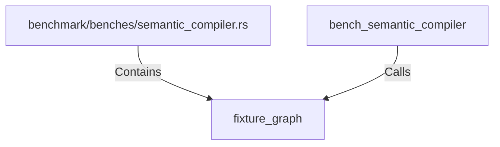

# fixture_graph (RustSymbol)

## Properties

| Key | Value |
|---|---|
| `kind` | function |

## Relationships

### Calls

- ← bench_semantic_compiler (`2e2e7f4e-47c7-594a-8c64-0ef5034a4988`)

### Contains

- ← benchmark/benches/semantic_compiler.rs (`95222458-b6a4-5b9c-bcc9-0e2e1909eb44`)

## Diagram

## Evidence

_No evidence cited._
