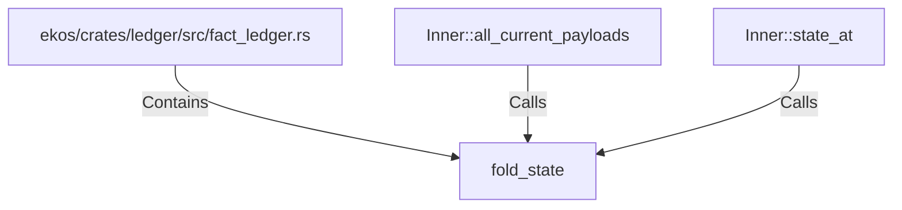

# fold_state (RustSymbol)

## Properties

| Key | Value |
|---|---|
| `kind` | function |

## Relationships

### Calls

- ← Inner::all_current_payloads (`cdae7ff9-bb1c-5b30-9d98-ae096c1c521f`)
- ← Inner::state_at (`f8ecc412-0c51-5275-8a0d-2f41777af9ac`)

### Contains

- ← ekos/crates/ledger/src/fact_ledger.rs (`eadcb59e-818f-5d1e-af87-ff29aba11423`)

## Diagram

## Evidence

_No evidence cited._
