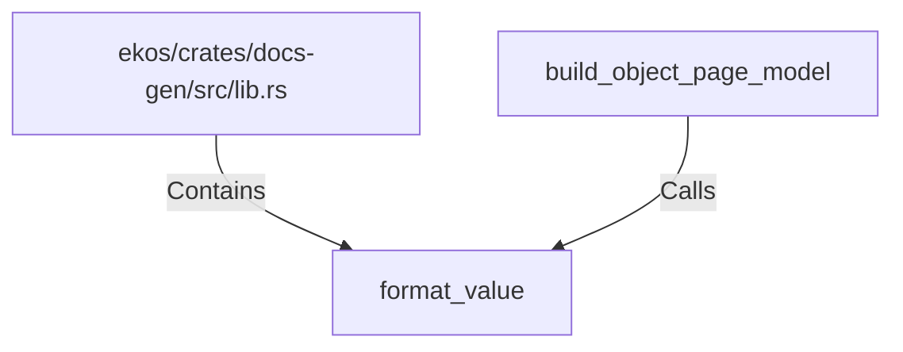

# format_value (RustSymbol)

## Properties

| Key | Value |
|---|---|
| `kind` | function |

## Relationships

### Calls

- ← build_object_page_model (`0b9a022b-a905-5064-bb70-9f4e04f76875`)

### Contains

- ← ekos/crates/docs-gen/src/lib.rs (`6ca4fba0-18e5-59b7-9876-7dae72e2ce0e`)

## Diagram

## Evidence

_No evidence cited._
