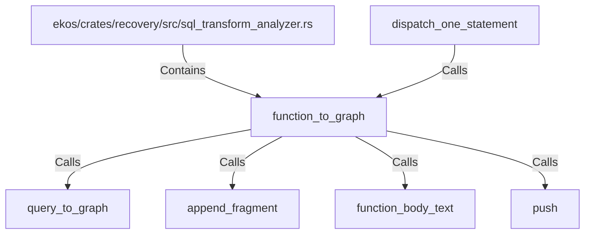

# function_to_graph (RustSymbol)

## Properties

| Key | Value |
|---|---|
| `kind` | function |

## Relationships

### Calls

- ← dispatch_one_statement (`23b79c8c-1748-5c88-b609-df3f07bd4779`)
- → query_to_graph (`f816648e-a2ad-50bd-bd73-494fdbbbad49`)
- → append_fragment (`c9869d76-7bdc-567d-a3ec-83128f3ac4cd`)
- → function_body_text (`0ac287c3-3b30-59c8-870a-4ba97857d319`)
- → push (`cc223cbc-9afd-5086-9f88-8c6d484895d1`)

### Contains

- ← ekos/crates/recovery/src/sql_transform_analyzer.rs (`987e3fbb-31ec-576d-b794-7e801336e8c8`)

## Diagram

## Evidence

_No evidence cited._
