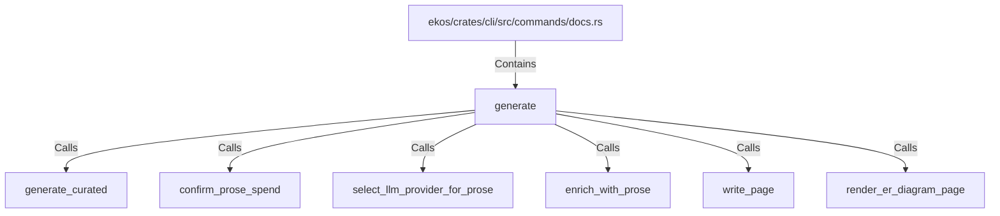

# generate (RustSymbol)

## Properties

| Key | Value |
|---|---|
| `kind` | function |

## Relationships

### Calls

- → generate_curated (`5a70d7a9-bb4c-59dc-a7cd-00be6ab7f553`)
- → confirm_prose_spend (`a41df42a-3316-58c5-82d0-b80aedac6aad`)
- → select_llm_provider_for_prose (`e9f6c656-18e6-51d4-a612-415a39136d77`)
- → enrich_with_prose (`3cdfa189-a68e-5bf7-a3c8-0f7579e2fc62`)
- → write_page (`6672efa9-4ce8-5c9c-a096-3c74f2963490`)
- → render_er_diagram_page (`76d267df-6bbf-58bb-8682-5bd99c95a7c2`)

### Contains

- ← ekos/crates/cli/src/commands/docs.rs (`5503d15b-112f-541f-8189-8be05a060beb`)

## Diagram

## Evidence

_No evidence cited._
