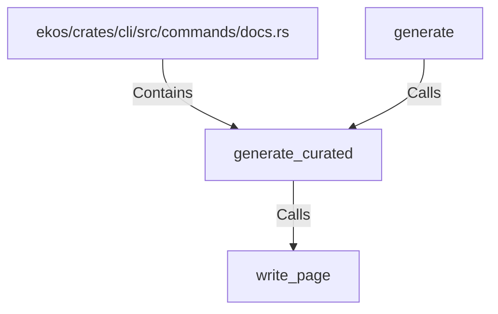

# generate_curated (RustSymbol)

## Properties

| Key | Value |
|---|---|
| `kind` | function |

## Relationships

### Calls

- ← generate (`9628a7cf-316d-5400-8261-6b2216ee01f1`)
- → write_page (`6672efa9-4ce8-5c9c-a096-3c74f2963490`)

### Contains

- ← ekos/crates/cli/src/commands/docs.rs (`5503d15b-112f-541f-8189-8be05a060beb`)

## Diagram

## Evidence

_No evidence cited._
