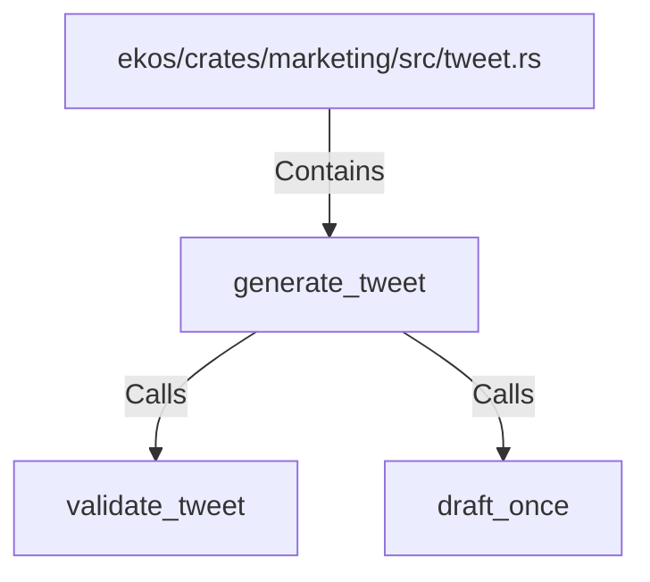

# generate_tweet (RustSymbol)

## Properties

| Key | Value |
|---|---|
| `kind` | function |

## Relationships

### Calls

- → validate_tweet (`37c3c5db-a1d7-5bdc-b147-227ec222d7dd`)
- → draft_once (`3638e3bf-a432-54bc-8ec8-3db1c55ae4e1`)

### Contains

- ← ekos/crates/marketing/src/tweet.rs (`3372ee6e-2a1d-50b2-a3ae-b17eb421301b`)

## Diagram

## Evidence

_No evidence cited._
