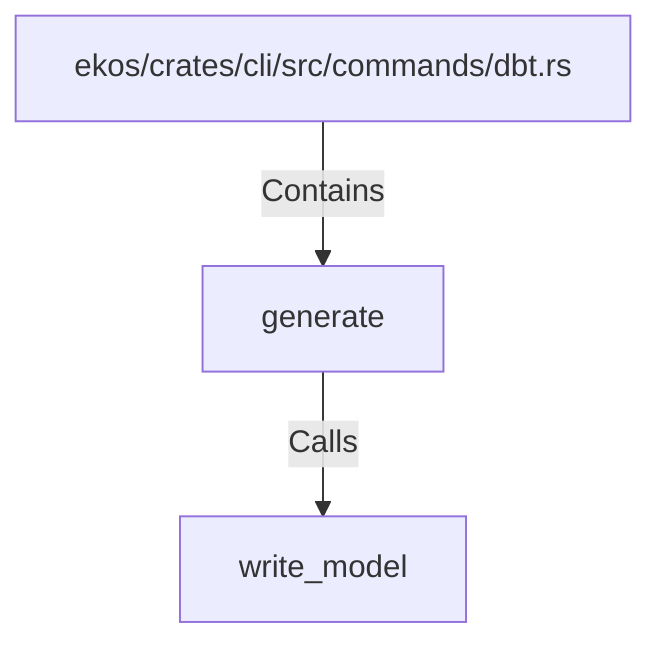

# generate (RustSymbol)

## Properties

| Key | Value |
|---|---|
| `kind` | function |

## Relationships

### Calls

- → write_model (`2180f492-2378-5709-97e5-354fd0aa04cf`)

### Contains

- ← ekos/crates/cli/src/commands/dbt.rs (`d3579ceb-9751-53ad-b6be-693f17509a70`)

## Diagram

## Evidence

_No evidence cited._
