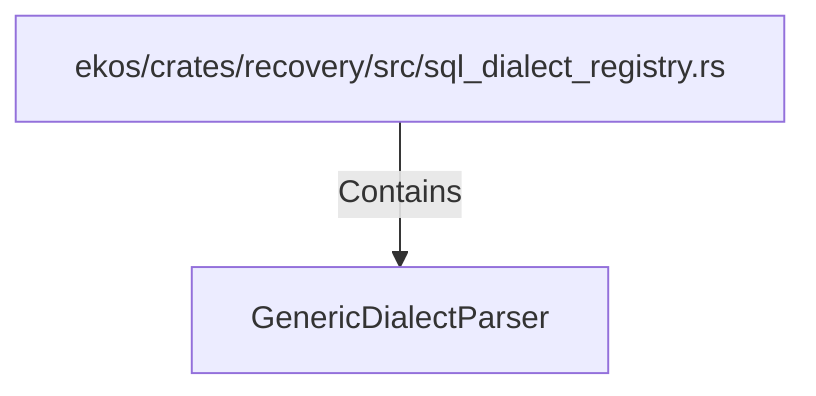

# GenericDialectParser (RustSymbol)

## Properties

| Key | Value |
|---|---|
| `kind` | struct |

## Relationships

### Contains

- ← ekos/crates/recovery/src/sql_dialect_registry.rs (`6e4ae0e1-9d1b-562a-a409-406a2ee0181a`)

## Diagram

## Evidence

_No evidence cited._
