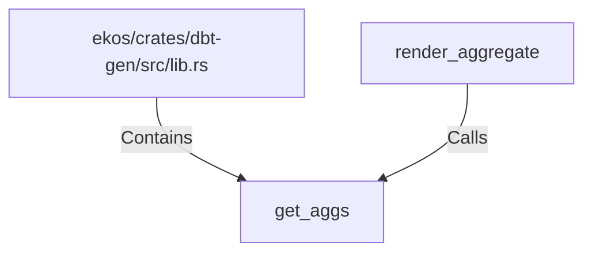

# get_aggs (RustSymbol)

## Properties

| Key | Value |
|---|---|
| `kind` | function |

## Relationships

### Calls

- ← render_aggregate (`f5e30215-3166-5317-b596-b7e4503b3607`)

### Contains

- ← ekos/crates/dbt-gen/src/lib.rs (`20d45ed0-c411-592d-8034-6486682f898c`)

## Diagram

## Evidence

_No evidence cited._
