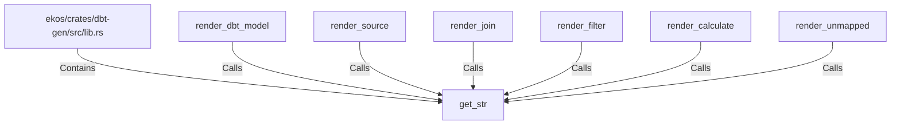

# get_str (RustSymbol)

## Properties

| Key | Value |
|---|---|
| `kind` | function |

## Relationships

### Calls

- ← render_dbt_model (`95ef6862-37ab-54fa-99de-4e67f2dffd69`)
- ← render_source (`02d30b92-2113-5cbb-8b26-27374d4a83c9`)
- ← render_join (`38a7c372-2ec4-5a38-a5fd-53f7c4bbf55c`)
- ← render_filter (`4976bdef-e8ee-5e02-9603-fe82d738e9c7`)
- ← render_calculate (`b7519843-e48d-57b7-ac81-6fdf21a72cdd`)
- ← render_unmapped (`130a2e45-93d9-563f-b669-b7e6e8bd7900`)

### Contains

- ← ekos/crates/dbt-gen/src/lib.rs (`20d45ed0-c411-592d-8034-6486682f898c`)

## Diagram

## Evidence

_No evidence cited._
